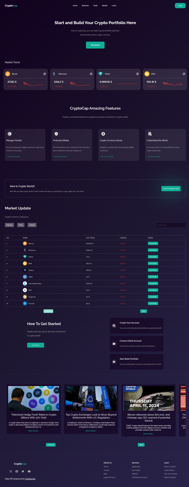
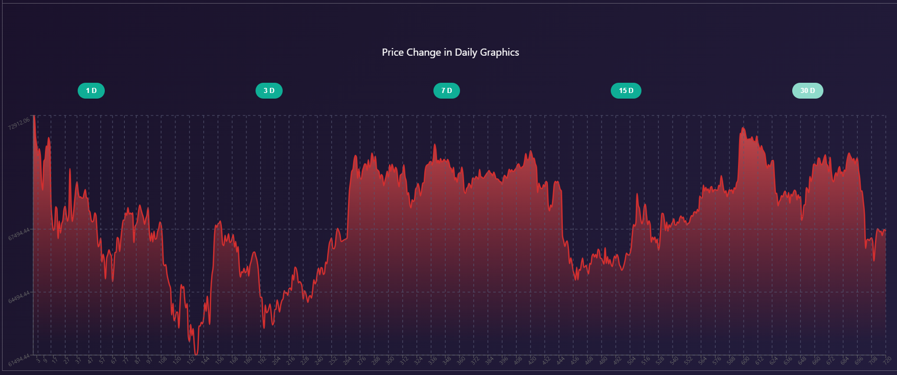

# Crypto World Website
## [Live Site](https://job-seeker-guvenfazli.vercel.app)
 
App preview
  
<h3>HomePage</h3>

<h3>Coin Detail Section with Responsive Charts</h3>

  

- Rendering the data with proper and clean util folders with useEffect and react router dom loader.
- Implement Advanced Search Functionality.
- Rendering crypto related news with responsive, smooth Carousel.
- Rendering coin stats with a recharts library with a responsive design.
- Using multiple APIs.
- Optimize Metadata and SEO.
- Usable fast and clean searchbar.
- Maintain a well-organized file and folder structure.
- Embrace the principles of writing clean code.
